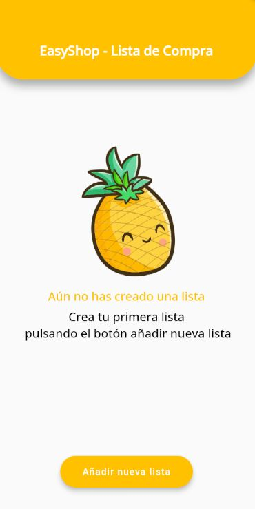
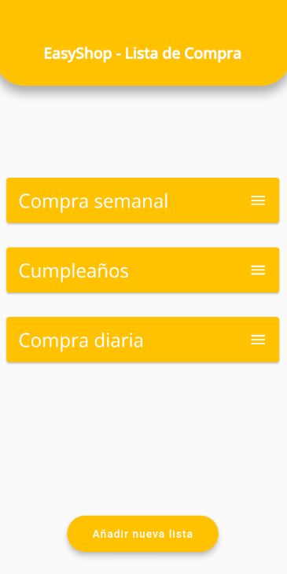
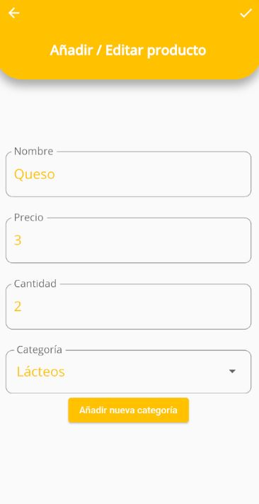

# EasyShop 🛒

EasyShop is a mobile application developed with Flutter that allows users to create and manage shopping lists easily and efficiently. This application is ideal for organizing user purchases in a very flexible way.

## Main Features ✨
- 📝 Create and edit shopping lists.
- 📦 Add items to the lists by categories, specifying their price and quantity.
- ✅ Mark items as purchased or pending.
- ⚙️ Quick controls to delete, edit, or add a product to favorites.

## Technologies Used 🛠️
- **Flutter**: UI framework.
- **Dart**: Programming language.

## Application Screenshots 📸

Below are previews of the most important functionalities of the application, showcasing the user interface design as well.

### Empty Home Screen
<p align="center">
    
</p>

### Home Screen with Lists
<p align="center">
    
</p>

### Shopping List with Items
<p align="center">
    
</p>

### Create a New Item
<p align="center">
    
</p>


## Installation 🚀

Follow these steps to set up the project in your local environment:

1. **Clone the repository**:
   ```bash
   git clone https://github.com/iLuu02/EasyShop.git
   cd easyshop

   ```
2. **Install the dependencies**:
Make sure you have Flutter installed on your device. You can find the installation guide [here](https://docs.flutter.dev/get-started/install/windows/mobile)

Then, navigate to the project folder, rename it to all lowercases (Dart restriction) and run the command to get the necessary dependencies:
```bash
    flutter create . 
    flutter pub get
```

3. **Run the app**
You can now run the application from a terminal using the command:
```bash
    flutter run
``` 
